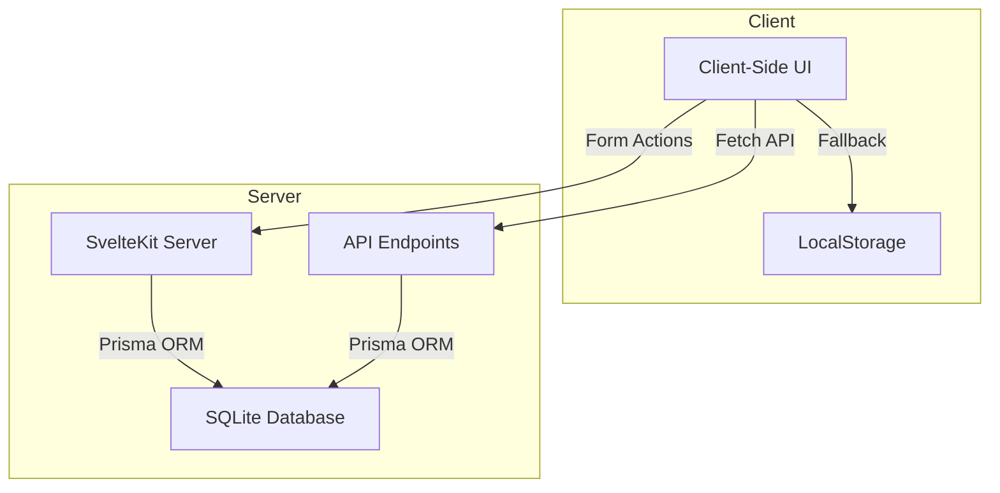

# Budget Tracker Database Migration Plan

## Overview

This document outlines the plan to migrate the Budget Tracker application from client-side localStorage persistence to server-side database storage using Prisma and SQLite. This migration will improve data reliability, enable multi-device synchronization, and lay the groundwork for future user authentication integration.

## Current Implementation

- The Budget Tracker currently uses client-side state management with the `PersistedState` class from the 'runed' library
- Data is stored in localStorage, which has limitations:
  - Limited storage capacity
  - Data is device-specific
  - No backup or recovery options
  - No user authentication or data sharing capabilities

## Migration Goals

1. Store budget and expense data in the SQLite database using Prisma ORM
2. Maintain the current UI and user experience
3. Implement server-side CRUD operations for budgets and expenses
4. Ensure data integrity and validation
5. Provide a smooth transition from localStorage to database storage
6. Enable future authentication integration

## Implementation Plan

### 1. Database Schema Updates

Add the following models to the Prisma schema (`prisma/schema.prisma`):

```prisma
model Budget {
  id        String    @id @default(uuid())
  name      String
  amount    Float
  currency  String
  userId    String?   @map("user_id")
  user      User?     @relation(fields: [userId], references: [id], onDelete: Cascade)
  expenses  Expense[]
  createdAt DateTime  @default(now()) @map("created_at")
  updatedAt DateTime  @updatedAt @map("updated_at")

  @@map("budgets")
}

model Expense {
  id          String   @id @default(uuid())
  description String
  amount      Float
  budgetId    String   @map("budget_id")
  budget      Budget   @relation(fields: [budgetId], references: [id], onDelete: Cascade)
  createdAt   DateTime @default(now()) @map("created_at")
  updatedAt   DateTime @updatedAt @map("updated_at")

  @@map("expenses")
}
```

After updating the schema, run a migration:

```bash
npx prisma migrate dev --name add_budget_models
```

### 2. Server-Side Implementation

Create server-side functionality in `src/routes/apps/(app)/budget-tracker/+page.server.ts`:

```typescript
// src/routes/apps/(app)/budget-tracker/+page.server.ts
import { error } from '@sveltejs/kit';
import type { PageServerLoad, Actions } from './$types';
import { prisma } from '$lib/server/db';

// Load function to fetch budgets and expenses
export const load = (async ({ locals }) => {
	// Check if user is authenticated (if auth is implemented)
	// const userId = locals.user?.id;

	// For now, we'll fetch all budgets without user filtering
	try {
		const budgets = await prisma.budget.findMany({
			include: {
				expenses: true
			},
			orderBy: {
				createdAt: 'desc'
			}
		});

		return {
			budgets
		};
	} catch (err) {
		console.error('Error fetching budgets:', err);
		throw error(500, 'Failed to load budgets');
	}
}) satisfies PageServerLoad;

// Actions for form submissions
export const actions = {
	// Create a new budget
	createBudget: async ({ request }) => {
		const data = await request.formData();
		const name = data.get('name')?.toString();
		const amount = parseFloat(data.get('amount')?.toString() || '0');
		const currency = data.get('currency')?.toString();

		// Validate inputs
		if (!name || isNaN(amount) || amount <= 0 || !currency) {
			return { success: false, error: 'Invalid budget data' };
		}

		try {
			const budget = await prisma.budget.create({
				data: {
					name,
					amount,
					currency
					// userId: locals.user?.id, // When auth is implemented
				}
			});

			return { success: true, budget };
		} catch (err) {
			console.error('Error creating budget:', err);
			return { success: false, error: 'Failed to create budget' };
		}
	},

	// Update an existing budget
	updateBudget: async ({ request }) => {
		const data = await request.formData();
		const id = data.get('id')?.toString();
		const name = data.get('name')?.toString();
		const amount = parseFloat(data.get('amount')?.toString() || '0');
		const currency = data.get('currency')?.toString();

		if (!id || !name || isNaN(amount) || amount <= 0 || !currency) {
			return { success: false, error: 'Invalid budget data' };
		}

		try {
			const budget = await prisma.budget.update({
				where: { id },
				data: { name, amount, currency }
			});

			return { success: true, budget };
		} catch (err) {
			console.error('Error updating budget:', err);
			return { success: false, error: 'Failed to update budget' };
		}
	},

	// Delete a budget
	deleteBudget: async ({ request }) => {
		const data = await request.formData();
		const id = data.get('id')?.toString();

		if (!id) {
			return { success: false, error: 'Budget ID is required' };
		}

		try {
			await prisma.budget.delete({
				where: { id }
			});

			return { success: true };
		} catch (err) {
			console.error('Error deleting budget:', err);
			return { success: false, error: 'Failed to delete budget' };
		}
	},

	// Create a new expense
	createExpense: async ({ request }) => {
		const data = await request.formData();
		const budgetId = data.get('budgetId')?.toString();
		const description = data.get('description')?.toString();
		const amount = parseFloat(data.get('amount')?.toString() || '0');

		if (!budgetId || !description || isNaN(amount) || amount <= 0) {
			return { success: false, error: 'Invalid expense data' };
		}

		try {
			const expense = await prisma.expense.create({
				data: {
					description,
					amount,
					budgetId
				}
			});

			return { success: true, expense };
		} catch (err) {
			console.error('Error creating expense:', err);
			return { success: false, error: 'Failed to create expense' };
		}
	},

	// Update an existing expense
	updateExpense: async ({ request }) => {
		const data = await request.formData();
		const id = data.get('id')?.toString();
		const description = data.get('description')?.toString();
		const amount = parseFloat(data.get('amount')?.toString() || '0');

		if (!id || !description || isNaN(amount) || amount <= 0) {
			return { success: false, error: 'Invalid expense data' };
		}

		try {
			const expense = await prisma.expense.update({
				where: { id },
				data: { description, amount }
			});

			return { success: true, expense };
		} catch (err) {
			console.error('Error updating expense:', err);
			return { success: false, error: 'Failed to update expense' };
		}
	},

	// Delete an expense
	deleteExpense: async ({ request }) => {
		const data = await request.formData();
		const id = data.get('id')?.toString();

		if (!id) {
			return { success: false, error: 'Expense ID is required' };
		}

		try {
			await prisma.expense.delete({
				where: { id }
			});

			return { success: true };
		} catch (err) {
			console.error('Error deleting expense:', err);
			return { success: false, error: 'Failed to delete expense' };
		}
	}
} satisfies Actions;
```

### 3. API Endpoints (Optional)

For more flexibility, implement RESTful API endpoints:

```typescript
// src/routes/api/budgets/+server.ts
import { json } from '@sveltejs/kit';
import { prisma } from '$lib/server/db';

export async function GET() {
	const budgets = await prisma.budget.findMany({
		include: { expenses: true }
	});
	return json(budgets);
}

export async function POST({ request }) {
	const { name, amount, currency } = await request.json();
	const budget = await prisma.budget.create({
		data: { name, amount, currency }
	});
	return json(budget);
}
```

Additional endpoints:

- `src/routes/api/budgets/[id]/+server.ts` - GET, PUT, DELETE for a specific budget
- `src/routes/api/budgets/[id]/expenses/+server.ts` - GET, POST for expenses of a budget
- `src/routes/api/expenses/[id]/+server.ts` - GET, PUT, DELETE for a specific expense

### 4. Client-Side Integration

Update the client-side state management in `src/routes/apps/(app)/budget-tracker/states.svelte.ts`:

```typescript
import { PersistedState } from 'runed';
import type { Budget, Expense } from './types';

// Create a persisted state for budgets with cross-tab synchronization
const budgetState = new PersistedState<Budget[]>('budgets', [], {
	storage: 'local',
	syncTabs: true
});

// Load budgets from the server
export async function loadBudgetsFromServer() {
	try {
		const response = await fetch('/api/budgets');
		if (!response.ok) throw new Error('Failed to fetch budgets');
		const budgets = await response.json();
		budgetState.current = budgets;
		return budgets;
	} catch (error) {
		console.error('Error loading budgets:', error);
		return [];
	}
}

// Add a budget
export async function addBudget(name: string, amount: number, currency: string) {
	try {
		// Create budget on the server
		const response = await fetch('/api/budgets', {
			method: 'POST',
			headers: { 'Content-Type': 'application/json' },
			body: JSON.stringify({ name, amount, currency })
		});

		if (!response.ok) throw new Error('Failed to create budget');
		const newBudget = await response.json();

		// Update local state
		budgetState.current = [...budgetState.current, newBudget];
		return newBudget;
	} catch (error) {
		console.error('Error adding budget:', error);
		// Fallback to local-only storage if server request fails
		const newBudget: Budget = {
			id: crypto.randomUUID(),
			name,
			amount,
			currency,
			expenses: [],
			createdAt: new Date().toISOString()
		};
		budgetState.current = [...budgetState.current, newBudget];
		return newBudget;
	}
}

// Update a budget
export async function updateBudget(id: string, name: string, amount: number, currency: string) {
	try {
		const response = await fetch(`/api/budgets/${id}`, {
			method: 'PUT',
			headers: { 'Content-Type': 'application/json' },
			body: JSON.stringify({ name, amount, currency })
		});

		if (!response.ok) throw new Error('Failed to update budget');
		const updatedBudget = await response.json();

		// Update local state
		budgetState.current = budgetState.current.map((budget) =>
			budget.id === id ? updatedBudget : budget
		);

		return updatedBudget;
	} catch (error) {
		console.error('Error updating budget:', error);
		// Fallback to local-only update
		const updatedBudgets = budgetState.current.map((budget) =>
			budget.id === id ? { ...budget, name, amount, currency } : budget
		);
		budgetState.current = updatedBudgets;
		return updatedBudgets.find((b) => b.id === id);
	}
}

// Delete a budget
export async function deleteBudget(id: string) {
	try {
		const response = await fetch(`/api/budgets/${id}`, {
			method: 'DELETE'
		});

		if (!response.ok) throw new Error('Failed to delete budget');

		// Update local state
		budgetState.current = budgetState.current.filter((budget) => budget.id !== id);
		return true;
	} catch (error) {
		console.error('Error deleting budget:', error);
		// Fallback to local-only deletion
		budgetState.current = budgetState.current.filter((budget) => budget.id !== id);
		return false;
	}
}

// Add an expense
export async function addExpense(budgetId: string, description: string, amount: number) {
	try {
		const response = await fetch(`/api/budgets/${budgetId}/expenses`, {
			method: 'POST',
			headers: { 'Content-Type': 'application/json' },
			body: JSON.stringify({ description, amount })
		});

		if (!response.ok) throw new Error('Failed to create expense');
		const newExpense = await response.json();

		// Update local state
		budgetState.current = budgetState.current.map((budget) =>
			budget.id === budgetId ? { ...budget, expenses: [...budget.expenses, newExpense] } : budget
		);

		return newExpense;
	} catch (error) {
		console.error('Error adding expense:', error);
		// Fallback to local-only storage
		const newExpense: Expense = {
			id: crypto.randomUUID(),
			description,
			amount,
			createdAt: new Date().toISOString()
		};

		const updatedBudgets = budgetState.current.map((budget) =>
			budget.id === budgetId ? { ...budget, expenses: [...budget.expenses, newExpense] } : budget
		);

		budgetState.current = updatedBudgets;
		return newExpense;
	}
}

// Update an expense
export async function updateExpense(
	budgetId: string,
	expenseId: string,
	description: string,
	amount: number
) {
	try {
		const response = await fetch(`/api/expenses/${expenseId}`, {
			method: 'PUT',
			headers: { 'Content-Type': 'application/json' },
			body: JSON.stringify({ description, amount })
		});

		if (!response.ok) throw new Error('Failed to update expense');
		const updatedExpense = await response.json();

		// Update local state
		budgetState.current = budgetState.current.map((budget) => {
			if (budget.id === budgetId) {
				return {
					...budget,
					expenses: budget.expenses.map((expense) => {
						if (expense.id === expenseId) {
							return updatedExpense;
						}
						return expense;
					})
				};
			}
			return budget;
		});

		return updatedExpense;
	} catch (error) {
		console.error('Error updating expense:', error);
		// Fallback to local-only update
		const updatedBudgets = budgetState.current.map((budget) => {
			if (budget.id === budgetId) {
				return {
					...budget,
					expenses: budget.expenses.map((expense) => {
						if (expense.id === expenseId) {
							return {
								...expense,
								description,
								amount,
								createdAt: new Date().toISOString()
							};
						}
						return expense;
					})
				};
			}
			return budget;
		});

		budgetState.current = updatedBudgets;
		return updatedBudgets.find((b) => b.id === budgetId)?.expenses.find((e) => e.id === expenseId);
	}
}

// Delete an expense
export async function deleteExpense(budgetId: string, expenseId: string) {
	try {
		const response = await fetch(`/api/expenses/${expenseId}`, {
			method: 'DELETE'
		});

		if (!response.ok) throw new Error('Failed to delete expense');

		// Update local state
		budgetState.current = budgetState.current.map((budget) =>
			budget.id === budgetId
				? { ...budget, expenses: budget.expenses.filter((e) => e.id !== expenseId) }
				: budget
		);

		return true;
	} catch (error) {
		console.error('Error deleting expense:', error);
		// Fallback to local-only deletion
		const updatedBudgets = budgetState.current.map((budget) =>
			budget.id === budgetId
				? { ...budget, expenses: budget.expenses.filter((e) => e.id !== expenseId) }
				: budget
		);

		budgetState.current = updatedBudgets;
		return false;
	}
}

// Export the budget state as a readable store
export const budgets = {
	subscribe: (callback: (value: Budget[]) => void) => {
		// Initial call with current value
		callback(budgetState.current);

		// Load from server when possible
		loadBudgetsFromServer().then((serverBudgets) => {
			if (serverBudgets.length > 0) {
				callback(serverBudgets);
			}
		});

		// Set up an effect to call the callback whenever budgetState.current changes
		const unsubscribe = $effect.root(() => {
			$effect(() => {
				// This will re-run whenever budgetState.current changes
				callback(budgetState.current);
			});

			// Handle cross-tab synchronization with the storage event
			const storageHandler = () => {
				callback(budgetState.current);
			};

			window.addEventListener('storage', storageHandler);

			// Return cleanup function
			return () => {
				window.removeEventListener('storage', storageHandler);
			};
		});

		// Return unsubscribe function
		return unsubscribe;
	},
	get current() {
		return budgetState.current;
	}
};
```

### 5. Form Handling in the UI

Update the UI components to use form actions:

#### BudgetSection.svelte

```svelte
<form method="POST" action="?/createBudget">
	<Input name="name" bind:value={budgetName} placeholder="Budget Name" class="flex-1" />
	<Input
		name="amount"
		bind:value={budgetAmount}
		type="text"
		placeholder="Amount"
		class="w-32"
		oninput={formatNumberInput}
	/>
	<input type="hidden" name="currency" value={selectedCurrency} />
	<Button type="submit" size="sm" class="gap-2">
		<PlusCircle class="h-4 w-4" />
		Add Budget
	</Button>
</form>
```

#### BudgetDialog.svelte

```svelte
<form method="POST" action="?/updateBudget">
	<input type="hidden" name="id" value={editingBudget?.id} />
	<Input name="name" bind:value={editBudgetName} placeholder="Budget Name" />
	<Input name="amount" type="number" bind:value={editBudgetAmount} placeholder="Budget Amount" />
	<input type="hidden" name="currency" value={editBudgetCurrency} />
	<Button type="submit">Save changes</Button>
</form>
```

#### ExpenseSection.svelte

```svelte
<form method="POST" action="?/createExpense">
	<input type="hidden" name="budgetId" value={selectedBudgetId} />
	<Input
		name="description"
		bind:value={expenseDescription}
		placeholder="Expense Description"
		class="flex-1"
	/>
	<Input
		name="amount"
		bind:value={expenseAmount}
		type="text"
		placeholder="Amount"
		class="w-32"
		oninput={formatNumberInput}
	/>
	<Button type="submit" size="sm" class="gap-2">
		<PlusCircle class="h-4 w-4" />
		Add Expense
	</Button>
</form>
```

#### ExpenseDialog.svelte

```svelte
<form method="POST" action="?/updateExpense">
	<input type="hidden" name="id" value={editingExpense?.expense.id} />
	<Input name="description" bind:value={editExpenseDescription} placeholder="Description" />
	<Input name="amount" type="number" bind:value={editExpenseAmount} placeholder="Amount" />
	<Button type="submit">Save Changes</Button>
</form>
```

### 6. Update +page.svelte

Modify the main page component to handle server data:

```svelte
<script lang="ts">
	import { onMount } from 'svelte';
	import type { PageData } from './$types';

	// Import existing components
	import BudgetsList from './BudgetsList.svelte';
	import FloatingBtn from './FloatingBtn.svelte';
	// ... other imports

	// Get server data
	export let data: PageData;

	// Initialize budgets from server data if available
	let budgets = $state<Budget[]>(data.budgets || []);

	// Subscribe to the budget state for real-time updates
	let unsubscribe: () => void;
	$effect.root(() => {
		unsubscribe = budgetState.subscribe((value) => {
			budgets = value;
		});

		return () => {
			if (unsubscribe) unsubscribe();
		};
	});

	// Load budgets from server on mount
	onMount(() => {
		loadBudgetsFromServer();
	});

	// ... rest of the component
</script>
```

### 7. Migration Strategy

#### Data Migration Script

Create a script to migrate existing localStorage data to the database:

```typescript
// src/routes/api/migrate-budgets/+server.ts
import { json } from '@sveltejs/kit';
import { prisma } from '$lib/server/db';

export async function POST({ request }) {
	try {
		const { budgets } = await request.json();

		// Process each budget
		const results = await Promise.all(
			budgets.map(async (budget: any) => {
				// Create the budget
				const newBudget = await prisma.budget.create({
					data: {
						id: budget.id, // Keep the same ID for consistency
						name: budget.name,
						amount: budget.amount,
						currency: budget.currency,
						createdAt: new Date(budget.createdAt)
					}
				});

				// Create all expenses for this budget
				if (budget.expenses && budget.expenses.length > 0) {
					await Promise.all(
						budget.expenses.map((expense: any) =>
							prisma.expense.create({
								data: {
									id: expense.id, // Keep the same ID
									description: expense.description,
									amount: expense.amount,
									budgetId: newBudget.id,
									createdAt: new Date(expense.createdAt)
								}
							})
						)
					);
				}

				return newBudget;
			})
		);

		return json({ success: true, migrated: results.length });
	} catch (error) {
		console.error('Migration error:', error);
		return json({ success: false, error: String(error) }, { status: 500 });
	}
}
```

#### Client-Side Migration Helper

Add a function to trigger the migration:

```typescript
// src/routes/apps/(app)/budget-tracker/migration.ts
export async function migrateLocalDataToServer() {
	try {
		// Get budgets from localStorage
		const localBudgets = JSON.parse(localStorage.getItem('budgets') || '[]');

		if (localBudgets.length === 0) {
			console.log('No local budgets to migrate');
			return { success: true, migrated: 0 };
		}

		// Send to server
		const response = await fetch('/api/migrate-budgets', {
			method: 'POST',
			headers: { 'Content-Type': 'application/json' },
			body: JSON.stringify({ budgets: localBudgets })
		});

		if (!response.ok) {
			throw new Error('Migration failed');
		}

		const result = await response.json();

		// If successful, mark as migrated in localStorage
		if (result.success) {
			localStorage.setItem('budgets_migrated', 'true');
		}

		return result;
	} catch (error) {
		console.error('Migration error:', error);
		return { success: false, error: String(error) };
	}
}
```

### 8. Authentication Integration (Future Enhancement)

When user authentication is implemented:

1. Update the Prisma schema to ensure the Budget model has a required userId field
2. Modify server-side functions to filter budgets by the authenticated user
3. Add permission checks to all API endpoints and form actions
4. Update the client-side code to handle user-specific data

## Implementation Timeline

1. **Week 1: Database Setup**

   - Update Prisma schema
   - Run migrations
   - Test database connections

2. **Week 2: Server-Side Implementation**

   - Implement +page.server.ts with load and actions
   - Create API endpoints
   - Test server-side functionality

3. **Week 3: Client-Side Integration**

   - Update states.svelte.ts to use server endpoints
   - Modify UI components to use form actions
   - Implement migration strategy

4. **Week 4: Testing and Refinement**
   - Test all functionality
   - Fix bugs and edge cases
   - Optimize performance
   - Document the implementation

## Architecture Diagram



## Conclusion

This migration plan provides a comprehensive approach to moving the Budget Tracker from client-side localStorage to server-side database storage. By following this plan, we'll create a more robust application with improved data persistence, while maintaining the current user experience and laying the groundwork for future enhancements like user authentication.
